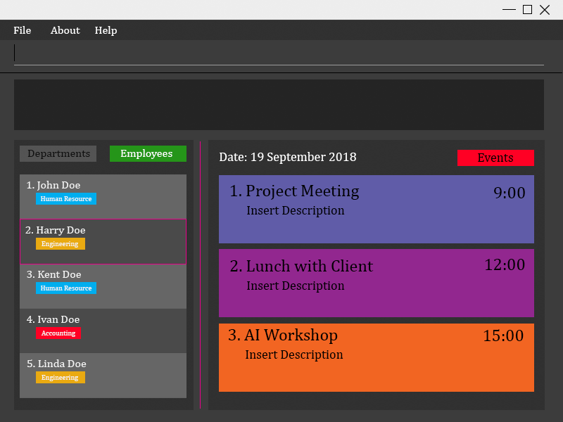

= ProManage
ifdef::env-github,env-browser[:relfileprefix: docs/]

https://travis-ci.org/nusCS2113-AY1819S1/addressbook-level4[image:https://travis-ci.org/nusCS2113-AY1819S1/addressbook-level4.svg?branch=master[Build Status]]
https://ci.appveyor.com/project/damithc/addressbook-level4[image:https://ci.appveyor.com/api/projects/status/3boko2x2vr5cc3w2?svg=true[Build status]]
https://coveralls.io/github/CS2113-AY1819S1-T16-2/main[image:https://coveralls.io/repos/github/CS2113-AY1819S1-T16-2/main/badge.svg?branch=master[Coverage Status]]
https://www.codacy.com/app/damith/addressbook-level4?utm_source=github.com&utm_medium=referral&utm_content=se-edu/addressbook-level4&utm_campaign=Badge_Grade[image:https://api.codacy.com/project/badge/Grade/fc0b7775cf7f4fdeaf08776f3d8e364a[Codacy Badge]]
https://gitter.im/se-edu/Lobby[image:https://badges.gitter.im/se-edu/Lobby.svg[Gitter chat]]

ifdef::env-github[]

endif::[]

ifndef::env-github[]
image::images/Ui-mockup.png[width="600"]
endif::[]

* This is a desktop Project Management application designed for project-based companies. It has a GUI but most of the user interactions happen using a CLI (Command Line Interface).
* We provide an all-in-one platform that saves our consumers’ time and money. Our customers will feel at ease communicating with one another in their project team setting.
* Managers of project team are now able to oversee their employees and overall project easily and conveniently.

* Features:
** Project teams management.
** Employees management.
** Department management.

== Site Map

* <<UserGuide#, User Guide>>
* <<DeveloperGuide#, Developer Guide>>
* <<LearningOutcomes#, Learning Outcomes>>
* <<AboutUs#, About Us>>
* <<ContactUs#, Contact Us>>

== Acknowledgements

* Based of https://github.com/se-edu/addressbook-level4[AddressBook-Level4 project] created by the https://github.com/se-edu/[SE-EDU initiative]
* Libraries used: https://github.com/TestFX/TestFX[TextFX], https://bitbucket.org/controlsfx/controlsfx/[ControlsFX], https://github.com/FasterXML/jackson[Jackson], https://github.com/google/guava[Guava], https://github.com/junit-team/junit5[JUnit5]

== Licence : link:LICENSE[MIT]

