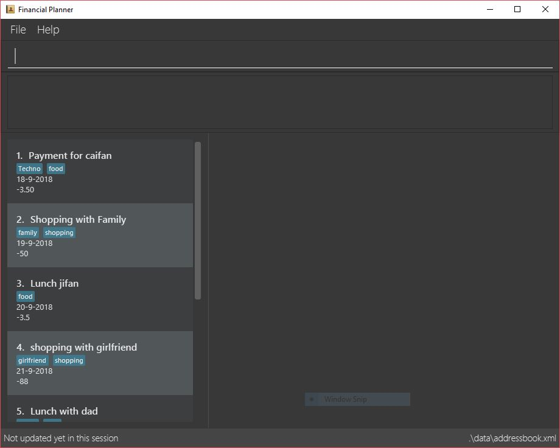

= RecruitBook
ifdef::env-github,env-browser[:relfileprefix: docs/]

https://travis-ci.org/nusCS2113-AY1819S1/addressbook-level4[image:https://travis-ci.org/nusCS2113-AY1819S1/addressbook-level4.svg?branch=master[Build Status]]
https://ci.appveyor.com/project/damithc/addressbook-level4[image:https://ci.appveyor.com/api/projects/status/3boko2x2vr5cc3w2?svg=true[Build status]]
https://coveralls.io/github/se-edu/addressbook-level4?branch=master[image:https://coveralls.io/repos/github/se-edu/addressbook-level4/badge.svg?branch=master[Coverage Status]]
https://www.codacy.com/app/damith/addressbook-level4?utm_source=github.com&utm_medium=referral&utm_content=se-edu/addressbook-level4&utm_campaign=Badge_Grade[image:https://api.codacy.com/project/badge/Grade/fc0b7775cf7f4fdeaf08776f3d8e364a[Codacy Badge]]
https://gitter.im/se-edu/Lobby[image:https://badges.gitter.im/se-edu/Lobby.svg[Gitter chat]]

Simplifying your job recruiting experience!

ifdef::env-github[]

endif::[]

ifndef::env-github[]
image::images/Ui.png[width="600"]
endif::[]

Are you a job agent looking to keep track of interviewed candidates and available job offers?

*Look no further.*

RecruitBook contains many features that is designed specifically to aid job agents:

* Candidates:

** Add candidates with customisable tags

** Filter and sort candidates based on expected salary, education level etc

** Shortlist candidates

** Blacklist candidates

** Automated email feature

* Job Offers:

** Add jobs offers with customisable tags

** Filter and sort job offers based on expected salary, minimum education level etc.

** List jobs based on urgency

== Site Map

* <<UserGuide#, User Guide>>
* <<DeveloperGuide#, Developer Guide>>
* <<AboutUs#, About Us>>
* <<ContactUs#, Contact Us>>

== Acknowledgements

* Some parts of this application was inspired by the excellent
http://code.makery.ch/library/javafx-8-tutorial/[Java FX tutorial] by Marco Jakob

* RecruitBook was created by a SE-EDU initiative at https://github.com/se-edu/

== Contact Us

* *Bug reports, Suggestions* : Post in our https://github.com/se-edu/addressbook-level3/issues[issue tracker]
if you noticed bugs or have suggestions on how to improve.
* *Contributing* : We welcome pull requests. Follow the process described https://github.com/oss-generic/process[here]
