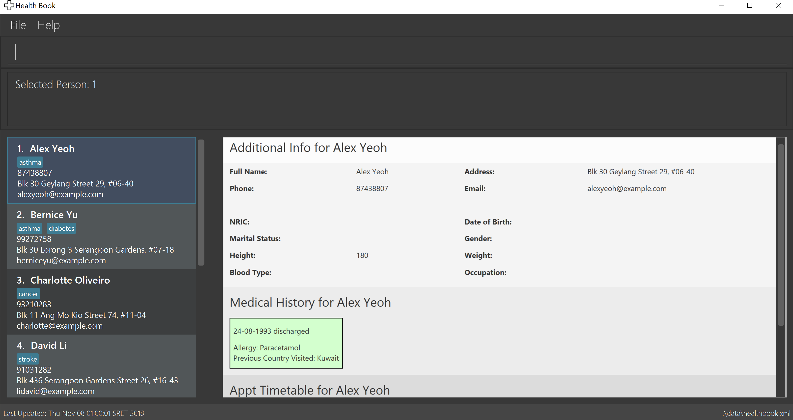

= Financial Planner
ifdef::env-github,env-browser[:relfileprefix: docs/]

https://travis-ci.org/se-edu/addressbook-level4[image:https://travis-ci.org/se-edu/addressbook-level4.svg?branch=master[Build Status]]
https://ci.appveyor.com/project/damithc/addressbook-level4[image:https://ci.appveyor.com/api/projects/status/3boko2x2vr5cc3w2?svg=true[Build status]]
https://coveralls.io/github/CS2113-AY1819S1-T09-4/main?branch=master[image:https://coveralls.io/repos/github/CS2113-AY1819S1-T09-4/main/badge.svg?branch=master[Coverage Status]]
https://gitter.im/se-edu/Lobby[image:https://badges.gitter.im/se-edu/Lobby.svg[Gitter chat]]

ifdef::env-github[]

endif::[]

ifndef::env-github[]
image::images/Ui.png[width="600"]
endif::[]

* This is a desktop Financial Planner application. It has a GUI but most of the user interactions happen using a CLI (Command Line Interface). +

*This app is mainly for users who want to:*

* Use typing as their main method of entering information into the app
* Organise their financial information using mostly CLI
* Have a visual representation of their financial data
* Store and retrieve their financial data efficiently

*This app is mainly written in an OOP fashion.* +

*What’s good about this project:*

* The app has a sophisticated GUI that includes a list panel, a table panel and also chart panels

* The app has the ability to show detailed visual representations of the financial expenditure and income data stored in the Financial Planner.

* The app has the ability to export financial information in the app to other formats like Excel.

* The app has auto-completion algorithm built in to aid in the typing.

* Contains many test cases, including automated GUI testing.

* Supports for Build Automation using Gradle and for Continuous Integration using Travis CI.

== Site Map

* <<UserGuide#, User Guide>>
* <<DeveloperGuide#, Developer Guide>>
* <<AboutUs#, About Us>>
* <<ContactUs#, Contact Us>>

== Acknowledgements

* Some parts of this sample application were inspired by the excellent http://code.makery.ch/library/javafx-8-tutorial/[Java FX tutorial] by
_Marco Jakob_.
* This application is modified from FinancialPlanner-Level4 project created by SE-EDU initiative at https://github.com/se-edu/
* Libraries used: https://github.com/TestFX/TestFX[TextFX], https://bitbucket.org/controlsfx/controlsfx/[ControlsFX], https://github.com/FasterXML/jackson[Jackson], https://github.com/google/guava[Guava], https://github.com/junit-team/junit5[JUnit5]

== Licence : link:LICENSE[MIT]

